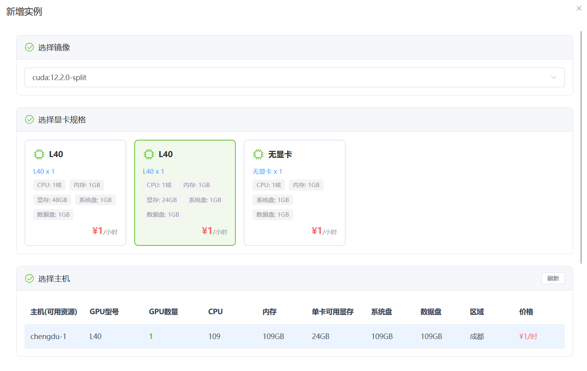
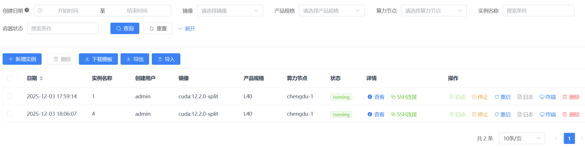
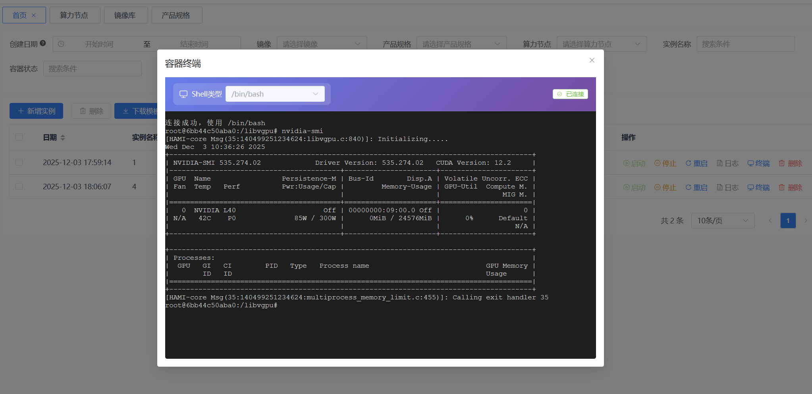
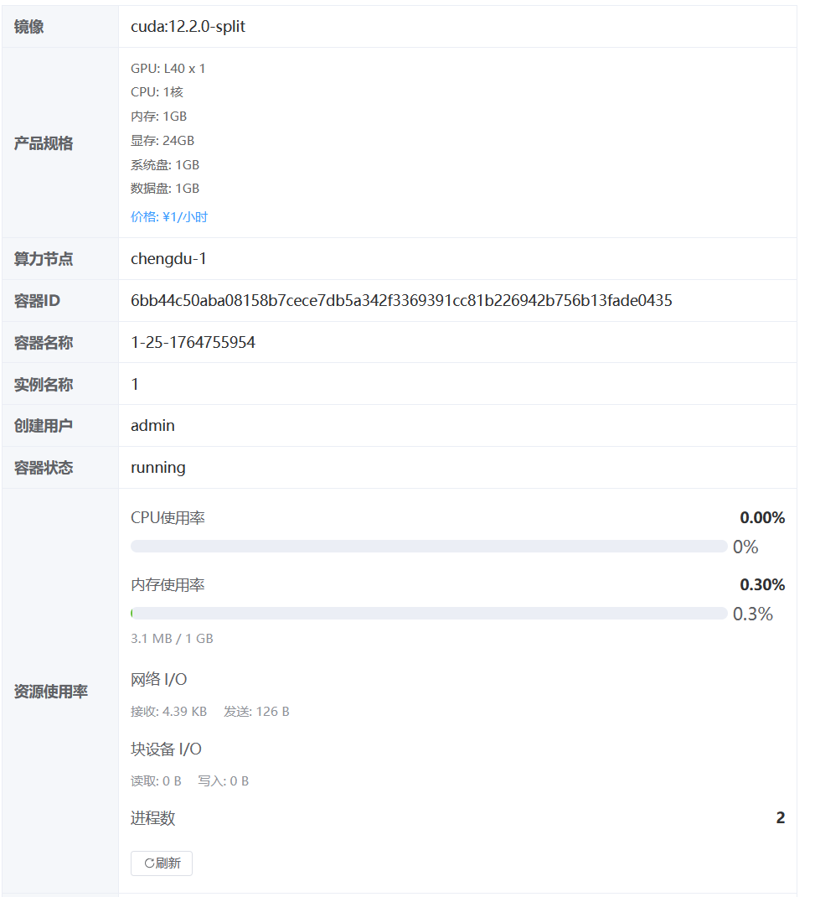

# Docker GPU 算力资源管理平台

## 📖 项目介绍

**Docker GPU 算力资源管理平台** 是一个企业级的 GPU 容器化资源管理和调度系统，旨在帮助组织高效、安全地管理和分配 GPU 算力资源。平台采用现代化的微服务架构，提供从资源管理到容器实例全生命周期的完整解决方案。

### 🚀 项目图片






### 🎯 项目目标

随着人工智能、深度学习、科学计算等领域的快速发展，GPU 算力资源已成为稀缺且昂贵的计算资源。传统的 GPU 资源管理方式存在以下痛点：

- **资源利用率低**：GPU 资源分配不灵活，难以实现细粒度的资源切分和共享
- **管理成本高**：多节点、多 GPU 环境下的资源管理复杂，缺乏统一的管理界面
- **安全性不足**：缺乏完善的权限控制和访问审计机制
- **运维效率低**：容器创建、监控、维护等操作需要大量人工干预

本平台致力于解决上述问题，提供：

✅ **统一的资源管理**：集中管理多个 GPU 算力节点，实现资源的统一调度和分配  
✅ **灵活的资源配置**：支持 GPU 显存切分，实现更细粒度的资源分配，提高资源利用率  
✅ **完整的生命周期管理**：从容器创建到删除的全流程自动化管理  
✅ **安全可靠的访问控制**：基于 RBAC 的权限管理，支持 SSH 跳板机和 Web 终端  
✅ **实时监控与运维**：容器状态自动同步、资源使用率实时监控、日志查看等运维功能  

### 🌟 核心特色

1. **智能资源匹配**：根据产品规格的 GPU 需求、显存需求、CPU、内存、磁盘等资源进行智能匹配，自动选择最优算力节点
2. **显存切分支持**：支持 HAMi 显存切分技术，可以将单块 GPU 的显存切分为多个虚拟 GPU，实现更灵活的资源配置
3. **多节点管理**：支持管理多个分布式 GPU 算力节点，支持 TLS 安全连接，自动检测节点状态
4. **SSH 跳板机服务**：提供安全的 SSH 跳板机功能，用户可以通过 SSH 连接跳板机后选择并连接到自己的容器实例
5. **Web 终端集成**：内置 Web 终端功能，无需额外工具即可在浏览器中直接操作容器
6. **实时资源监控**：提供 CPU、内存、网络 I/O、块设备 I/O、进程数等实时监控指标
7. **自动化运维**：定时任务自动检查容器状态，保持数据同步，减少人工干预

### 🎨 应用场景

- **AI/ML 训练平台**：为机器学习团队提供按需的 GPU 容器实例，支持模型训练和推理
- **科研计算平台**：为科研机构提供 GPU 算力资源池，支持科学计算、仿真等任务
- **云服务提供商**：为云服务商提供 GPU 容器化服务的基础平台
- **企业内部算力管理**：帮助企业统一管理内部 GPU 资源，提高资源利用率和运维效率
- **教育机构**：为高校和培训机构提供 GPU 教学实验环境

### 🚀 技术亮点

- **前后端分离架构**：采用 Gin + Vue3 的现代化技术栈，前后端完全分离，便于开发和维护
- **微服务设计**：模块化设计，各功能模块独立，易于扩展和维护
- **安全可靠**：支持 Docker TLS 安全连接，基于 RBAC 的权限控制，SSH 跳板机安全访问
- **高性能**：基于 Go 语言开发，性能优异，支持高并发场景
- **易于部署**：提供 Docker 和 Kubernetes 部署方案，支持一键部署

### 核心功能

- 🐳 **容器实例管理**：创建、启动、停止、重启、删除 GPU 容器实例，支持自动删除挂载数据卷
- 🖥️ **算力节点管理**：管理多个 GPU 算力节点，支持 TLS 安全连接，自动测试 Docker 连接状态
- 📦 **镜像库管理**：统一管理 Docker 镜像仓库，支持显存切分配置
- 💰 **产品规格管理**：定义 GPU 产品规格和定价，支持无显卡规格（GPU=0）和显存切分
- 🔐 **SSH 跳板机**：通过 SSH 安全连接到容器实例
- 💻 **Web 终端**：在浏览器中直接操作容器
- 📊 **资源监控**：实时查看容器状态、日志、CPU/内存使用率、网络 I/O、块设备 I/O、进程数
- 👥 **权限管理**：基于角色的访问控制（RBAC）
- ⚡ **显存切分**：支持GPU显存切分，更灵活地分配GPU资源
- ⏰ **定时任务**：自动检查容器状态，保持数据同步

### 功能模块

#### 1. 镜像库管理
管理 Docker 镜像仓库信息，支持多镜像源配置。

| 字段 | 类型 | 必填 | 说明 |
|------|------|------|------|
| 名字 | string | ✅ | 镜像库名称 |
| 地址 | string | ✅ | 镜像库地址 |
| 描述 | string | | 镜像库描述 |
| 来源 | string | | 镜像库来源 |
| 是否支持显存切分 | bool | ✅ | 默认否，是否支持GPU显存切分 |
| 是否上架 | bool | ✅ | 默认上架 |
| 备注 | string | | 备注信息 |

#### 2. 算力节点管理
管理 GPU 算力节点，支持 Docker TLS 安全连接，自动测试 Docker 连接状态。

| 字段 | 类型 | 必填 | 说明 |
|------|------|------|------|
| 名字 | string | ✅ | 节点名称 |
| 区域 | string | | 节点区域 |
| CPU | string | | CPU 信息 |
| 内存 | string | | 内存信息 |
| 系统盘容量 | string | | 系统盘大小 |
| 数据盘容量 | string | | 数据盘大小 |
| IP地址公网 | string | ✅ | 公网 IP |
| IP地址内网 | string | ✅ | 内网 IP |
| SSH端口 | int | ✅ | 默认 22 |
| 用户名 | string | | SSH 用户名 |
| 密码 | string | | SSH 密码 |
| 显卡名称 | string | | GPU 型号 |
| 显卡数量 | int | | GPU 数量 |
| 显存容量 | int | | 单卡显存容量(GB) |
| HAMi-core目录 | string |  | 节点HAMi-core build目录路径，用于显存切分挂载，示例：/root/HAMi-core/build |
| Docker连接地址 | string | | Docker API 地址 |
| 使用TLS | bool | | 默认启用 |
| CA证书 | text | | TLS CA 证书 |
| 客户端证书 | text | | TLS 客户端证书 |
| 客户端私钥 | text | | TLS 客户端私钥 |
| Docker状态 | string | | 自动测试（connected/failed/unknown） |
| 是否上架 | bool | ✅ | 默认上架 |
| 备注 | string | | 备注信息 |

**功能特性：**
- ✅ 创建或更新节点时自动测试 Docker TCP 连接
- ✅ 实时显示 Docker 连接状态（已连接/连接失败/未知）
- ✅ 支持 TLS 和非 TLS 连接测试

#### 3. 产品规格管理
定义 GPU 算力产品规格和定价，支持无显卡规格（CPU 容器）。

| 字段 | 类型 | 必填 | 说明 |
|------|------|------|------|
| 名称 | string | ✅ | 规格名称 |
| 显卡型号 | string | | GPU 型号（GPU=0 时可为空） |
| 显卡数量 | int | | GPU 数量（0 表示无显卡） |
| 显存容量(GB) | int | | 显存容量 |
| 是否支持显存切分 | bool | ✅ | 默认否，是否支持GPU显存切分 |
| CPU核心数 | int | | CPU 核心数 |
| 内存(GB) | int | | 内存大小 |
| 系统盘容量(GB) | int | | 系统盘大小 |
| 数据盘容量(GB) | int | | 数据盘大小 |
| 价格/小时 | float64 | | 每小时价格 |
| 是否上架 | bool | ✅ | 默认上架 |
| 备注 | string | | 备注信息 |

**功能特性：**
- ✅ 支持无显卡规格（GPU=0），创建容器时不挂载 GPU 参数
- ✅ 无显卡规格匹配节点时，不检查 GPU 型号和数量
- ✅ 所有节点都可以匹配无显卡规格（只要满足 CPU、内存、磁盘要求）
- ✅ 支持显存切分功能，可以更灵活地分配GPU显存资源
- ✅ 根据镜像和产品规格的显存切分支持情况，智能过滤可用规格
- ✅ 支持显存切分的产品规格创建容器时，自动添加HAMi显存切分相关参数

#### 4. 实例管理
管理 GPU 容器实例的完整生命周期，提供丰富的容器操作功能。

**数据字段：**

| 字段 | 类型 | 必填 | 说明 |
|------|------|------|------|
| 镜像 | 关联 | ✅ | 关联镜像库 |
| 产品规格 | 关联 | ✅ | 关联产品规格 |
| 用户 | 关联 | | 后端自动填写 |
| 算力节点 | 关联 | ✅ | 关联算力节点 |
| Docker容器ID | string | | 后端自动回填 |
| Docker容器名称 | string | | 后端自动回填（格式：名称-实例ID-时间戳） |
| 实例名称 | string | ✅ | 实例名称 |
| 容器状态 | string | | 后端自动填写（running/exited/creating/failed） |
| 备注 | string | | 备注信息 |

**支持操作：**

- **查看**：查看实例详细信息，包括资源使用率监控
- **SSH连接**：显示SSH连接命令，支持一键复制
- **启动**：启动已停止的容器
- **停止**：停止运行中的容器
- **重启**：重启容器实例
- **日志**：查看容器运行日志（支持实时刷新）
- **终端**：Web终端，在浏览器中直接操作容器（支持bash/sh）
- **删除**：删除实例和对应的容器，自动删除挂载的数据卷

**新增实例功能：**
- ✅ 智能主机匹配：根据产品规格的GPU需求、显存需求、CPU、内存、磁盘等资源进行智能匹配
- ✅ 显存切分支持：根据镜像的显存切分支持情况，自动过滤可用的产品规格
- ✅ 单卡显存显示：在选择主机时显示单卡可用显存大小，便于判断是否满足需求
- ✅ 实例名称校验：实例名称仅支持字母、数字、横线和下划线，不支持中文
- ✅ 资源分配优化：支持按卡分配显存，更精确地管理GPU资源
- ✅ 容器创建时如启用显存切分：从“算力节点”的 HAMi-core 目录字段读取路径，挂载到容器 /libvgpu/build，并自动注入 LD_PRELOAD、CUDA_DEVICE_MEMORY_LIMIT、CUDA_DEVICE_SM_LIMIT 环境变量；如未配置则使用默认路径 /root/HAMi-core-main/build

**资源监控：**
- ✅ **CPU使用率**：实时显示 CPU 使用百分比（进度条）
- ✅ **内存使用率**：实时显示内存使用百分比和详细使用量（进度条）
- ✅ **网络 I/O**：显示网络接收和发送字节数
- ✅ **块设备 I/O**：显示块设备读取和写入字节数
- ✅ **进程数**：显示当前容器进程数
- ✅ 自动刷新：容器运行时每 5 秒自动刷新统计信息
- ✅ 手动刷新：支持手动刷新按钮

**容器状态：**
- `creating`：创建中
- `running`：运行中
- `exited`：已停止
- `failed`：创建失败

**权限控制：**
- 普通用户：只能操作自己创建的实例
- 管理员：可以操作所有实例

**定时任务：**
- ✅ 容器状态自动检查：每30秒自动检查所有容器的运行状态
- ✅ 节点Docker状态检查：每5分钟检查所有算力节点的 Docker 连接状态，并更新节点的 DockerStatus 字段（connected/failed）
- ✅ 状态自动同步：自动将Docker容器的实际状态同步到数据库
- ✅ 使用 gcron 定时任务框架，稳定可靠

**数据卷管理：**
- ✅ 删除容器时自动删除所有挂载的命名数据卷
- ✅ 自动识别容器挂载的所有数据卷（不仅仅是默认的数据卷）
- ✅ 即使容器删除失败，也会尝试删除数据卷

#### 5. SSH跳板机服务
提供SSH跳板机功能，用户可以通过SSH连接跳板机，然后选择并连接到自己的容器实例。

**功能特性：**
- ✅ SSH密码认证（使用系统用户账号密码）
- ✅ 自动显示用户创建的容器列表
- ✅ 支持管理员查看所有容器
- ✅ 交互式容器选择
- ✅ 自动连接到选定的容器
- ✅ 终端窗口大小自动适配（支持vim等编辑器）
- ✅ 支持TLS和非TLS的Docker连接

**配置说明：**

在 `server/config.yaml` 中配置：

```yaml
jumpbox:
  enabled: true          # 是否启用SSH跳板机
  port: 2026            # SSH监听端口（默认2026）
  server-ip: "192.168.112.148"
  host-key: ""          # SSH主机密钥路径（可选，不设置则自动生成）
  banner: "欢迎使用SSH跳板机服务\r\n"  # SSH欢迎信息
```

**使用方法：**

1. **启动服务**
   - SSH跳板机服务会在后端服务启动时自动启动（如果enabled=true）
   - 默认监听端口：2026

2. **连接跳板机**
   ```bash
   ssh -p 2026 用户名@服务器IP
   # 例如：ssh -p 2026 admin@192.168.112.148
   ```

3. **认证登录**
   - 输入系统用户密码进行认证
   - 认证成功后显示容器列表

4. **选择容器**
   - 查看显示的容器列表（格式：序号 实例名称-容器ID-算力节点）
   - 输入序号选择要连接的容器
   - 输入 'q' 退出

5. **容器操作**
   - 连接成功后即可在容器内执行命令
   - 支持vim等编辑器，窗口大小自动适配
   - 在vim中使用 `Shift+Insert` 或鼠标中键可以粘贴剪贴板内容

**权限说明：**
- 普通用户：只能看到和连接自己创建的容器
- 管理员（authorityId=888）：可以看到和连接所有容器

**前端操作：**
- 在实例管理页面，点击"SSH连接"按钮
- 系统会显示SSH连接命令，支持一键复制

### 技术栈

**后端技术：**
- **框架**: Gin (Go Web框架)
- **ORM**: GORM (Go ORM库)
- **语言**: Go 1.23+
- **SSH服务**: golang.org/x/crypto/ssh
- **Docker客户端**: Docker API (github.com/docker/docker)
- **定时任务**: gcron (github.com/gogf/gf/v2/os/gcron)
- **日志**: Zap (高性能日志库)
- **配置管理**: Viper

**前端技术：**
- **框架**: Vue 3
- **UI组件**: Element Plus
- **构建工具**: Vite
- **状态管理**: Pinia
- **路由**: Vue Router

**数据库：**
- **主数据库**: MySQL
- **支持**: PostgreSQL, SQLite, MSSQL, Oracle (通过GORM)

**容器技术：**
- **容器引擎**: Docker
- **支持**: Docker TLS 安全连接
- **容器操作**: 创建、启动、停止、重启、删除、日志查看、终端连接
- **显存切分**: 支持HAMi显存切分，通过环境变量和卷挂载实现GPU显存虚拟化

### 📦 部署指南

#### 环境要求

**后端环境：**
- Go 1.23+ 
- MySQL 5.7+ / PostgreSQL / SQLite / MSSQL / Oracle
- Redis（可选，用于缓存和会话管理）
- Docker（用于管理GPU容器）

**前端环境：**
- Node.js 20+
- npm 或 pnpm

#### 方式一：本地开发部署

##### 1. 克隆项目

```bash
git clone https://github.com/hequan2017/docker-gpu-manage
cd docker-gpu-manage
\mv server/config.yaml.bak  server/config.yaml
```

##### 2. 配置数据库

系统会通过Web界面引导初始化。

##### 3. 启动后端服务

```bash
cd server

# 安装依赖
go mod download

# 启动服务
go run main.go
```

```json
#添加mcp
{
  "mcpServers": {
    "GVA Helper": {
      "url": "http://127.0.0.1:8888/sse"
    }
  }
}
```

后端服务默认运行在 `http://localhost:8888`

##### 4. 初始化数据库

**方法一：通过Web界面初始化（推荐）**

1. 启动前端服务（见步骤5）
2. 访问 `http://localhost:8080`
3. 系统会自动检测数据库是否已初始化
4. 如果未初始化，会跳转到数据库初始化页面
5. 填写数据库连接信息：
   - 数据库类型（MySQL/PostgreSQL/SQLite/MSSQL/Oracle）
   - 数据库地址和端口
   - 数据库名称（如果不存在会自动创建）
   - 用户名和密码
6. 点击"初始化"按钮，系统会自动创建数据库和所有表结构
7. 初始化完成后，会自动创建默认管理员账号（用户名：`admin`，密码：`123456`）

##### 5. 显存切割镜像制作

1.参考下面的项目,在docker server部署，并制作镜像。

```bash
git clone https://github.com/Project-HAMi/HAMi-core
```
2.制作完成后， 把对应的docker server 实际的HAMi-core目录  填到 算力节点的 HAMi-core目录


**方法二：手动初始化**

如果数据库已存在，系统会在启动时自动执行数据库迁移，创建所有必要的表结构。

##### 5. 启动前端服务

```bash
cd web

# 安装依赖
npm install
# 或使用 pnpm
pnpm install

# 启动开发服务器
npm run dev
# 或
pnpm dev
```

前端服务默认运行在 `http://localhost:8080`

##### 6. 访问系统

- 前端地址：`http://localhost:8080`
- 后端API：`http://localhost:8888`
- Swagger文档：`http://localhost:8888/swagger/index.html`

**默认管理员账号：**
- 用户名：`admin`
- 密码：`123456`

**首次登录后请及时修改密码！**

#### 方式二：Docker 部署

##### 1. 使用 Docker Compose 一键部署

```bash
cd deploy/docker-compose

# 修改 docker-compose.yaml 中的数据库配置（可选）
# 默认配置：
# - MySQL 端口：13306
# - Redis 端口：16379
# - 后端服务端口：8888
# - 前端服务端口：8080

# 启动所有服务
docker-compose up -d

# 查看服务状态
docker-compose ps

# 查看日志
docker-compose logs -f
```

##### 2. 初始化数据库

1. 等待所有容器启动完成（约1-2分钟）
2. 访问 `http://localhost:8080`
3. 按照Web界面提示完成数据库初始化

##### 3. 访问系统

- 前端地址：`http://localhost:8080`
- 后端API：`http://localhost:8888`
- MySQL：`localhost:13306`
- Redis：`localhost:16379`

##### 4. 停止服务

```bash
cd deploy/docker-compose
docker-compose down

# 如需删除数据卷（会清空数据库）
docker-compose down -v
```

#### 方式三：Kubernetes 部署

项目提供了 Kubernetes 部署配置文件，位于 `deploy/kubernetes/` 目录。

```bash
cd deploy/kubernetes

# 部署后端服务
kubectl apply -f server/

# 部署前端服务
kubectl apply -f web/
```

详细配置请参考 `deploy/kubernetes/` 目录下的配置文件。

#### 配置说明

##### 后端配置（server/config.yaml）

**重要配置项：**

```yaml
# 系统配置
system:
  db-type: mysql          # 数据库类型
  addr: 8888              # 服务监听地址和端口
  use-redis: false        # 是否使用Redis（建议生产环境开启）

# SSH跳板机配置
jumpbox:
  enabled: true            # 是否启用SSH跳板机
  port: 2026              # SSH监听端口

# JWT配置
jwt:
  signing-key: your-key    # JWT签名密钥（生产环境请修改）
  expires-time: 7d         # Token过期时间
```

##### 前端配置

前端API地址配置在 `web/src/utils/request.js` 中，默认指向 `http://localhost:8888`。

#### 常见问题

**1. 数据库连接失败**
- 检查数据库服务是否启动
- 检查 `config.yaml` 中的数据库配置是否正确
- 检查数据库用户是否有创建数据库的权限

**2. 前端无法连接后端**
- 检查后端服务是否正常启动
- 检查前端配置中的API地址是否正确
- 检查防火墙和端口是否开放

**3. Docker容器无法连接**
- 检查Docker服务是否运行
- 检查Docker TLS配置是否正确（如果使用TLS）
- 检查网络连接和防火墙设置

**4. SSH跳板机无法连接**
- 检查 `jumpbox.enabled` 是否为 `true`
- 检查SSH端口是否被占用
- 检查防火墙是否开放SSH端口（默认2026）

#### 生产环境建议

1. **安全性**
   - 修改默认管理员密码
   - 修改JWT签名密钥
   - 启用HTTPS
   - 配置防火墙规则

2. **性能优化**
   - 启用Redis缓存
   - 配置数据库连接池
   - 使用Nginx反向代理
   - 启用Gzip压缩

3. **监控和日志**
   - 配置日志轮转
   - 设置日志级别
   - 配置监控告警
   - 定期备份数据库

### 项目结构

```
├── server/                 # 后端代码
│   ├── api/v1/            # API 控制器
│   ├── model/             # 数据模型
│   ├── service/           # 业务逻辑
│   │   └── jumpbox/       # SSH跳板机服务
│   ├── router/            # 路由配置
│   └── config/            # 配置文件
├── web/                    # 前端代码
│   ├── src/api/           # API 调用
│   └── src/view/          # 页面组件
└── README.md
```
